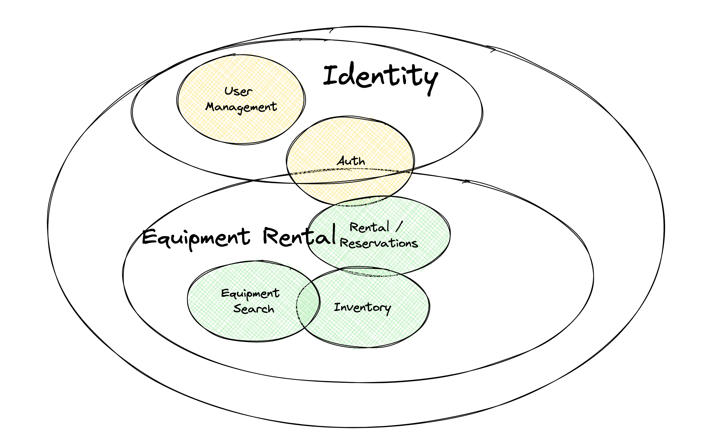
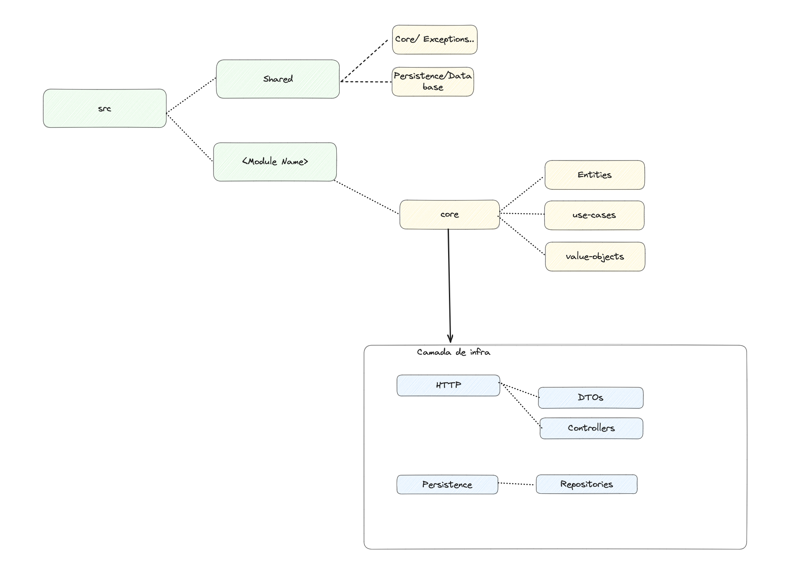

## Domain understanding



Based on the described requirements, I've constructed a high-level domain to help me understand the system's implementation and responsibilities.

I've identified two main sub-domains:

Equipment Rental, which is the core. This is the distinguishing feature of the business, and where the majority of the effort should be directed.

The Identity sub-domain, which pertains to user management, as well as authentication and authorization.

For simplicity, my implementation focuses solely on equipment rental. In a real-world scenario, I'd likely initiate with two modules: Identity and Equipment Rental, adhering to a modular monolithic architecture.

I've also tried to represent the equipment in the system in different ways, given equipment can be of different types like Earth Moving, Material Handling... And each of these types have specific details, my designs accommodate this.

## Code design and internal architecture



The architecture is primarily based on Domain Driven Design, complemented by Hexagonal and Clean Architecture concepts. The primary objective is to segregate the business logic from everything else.

I prefer using DDD for applications poised for growth and that encompass inherent complexity. It facilitates the code's alignment with the business processes and enhances comprehension. Naturally, for a real application, I would initially assess its potential for growth and determine if the anticipated usage justifies this architectural approach.

## Technologies

### Nest.js framework

I like to use Nest because it offers modularity and good tooling and is not too intrusive allowing the business logic to be designed in the way I want

### Prisma ORM

I'm still evaluating Prisma, I've not used it at a high scale and I already found a few things that I want to explore further, that's why I used this opportunity to test it a bit more.

### Postgres

Usually, it's my go-to storage for data that are starting and I'm not sure about how will be accessed and the usage.

## Tests

I've incorporated three types of tests:

### End-to-End Tests

These are comprehensive tests designed to evaluate the entire flow, from an API endpoint to the database. They are located in the root of the module, under the `__test__/e2e` directory.

### Unit Tests

These encompass most of the classes and are situated close to the classes they test, found in the `__test__/unit` directory.

### Integration Tests

I appreciate the utility of integration tests at various tiers of the application. In this instance, I've utilized them solely to test the repositories against the database. I prefer engaging with the actual database in repository tests to rigorously assess the use cases. They are housed in the `__test__/integration` directory.

## Installation and running the app

What you need to run the app

- Docker
- Node v19+
- Yarn

1. Rename the `.env.default` file to `.env` // this includes the database credentials

```bash
$ yarn install //install the necessary dependencies

$ docker-compose up -d //starts Postgres

$ yarn db:setup //create the tables and setups up the database

$ yarn start:dev //I suggest running in dev mode, I didn't have time to optimize for production

$ yarn db:seed //adds some dummy data to the database, 3 equipment
```

The app is available on `localhost/3000`
Documentation is available on `http://localhost:3000/api`

## Running the tests

```bash
$ yarn test:unit

$ yarn test:integration

$ yarn test:e2e

$ yarn test //runs all tests
```
